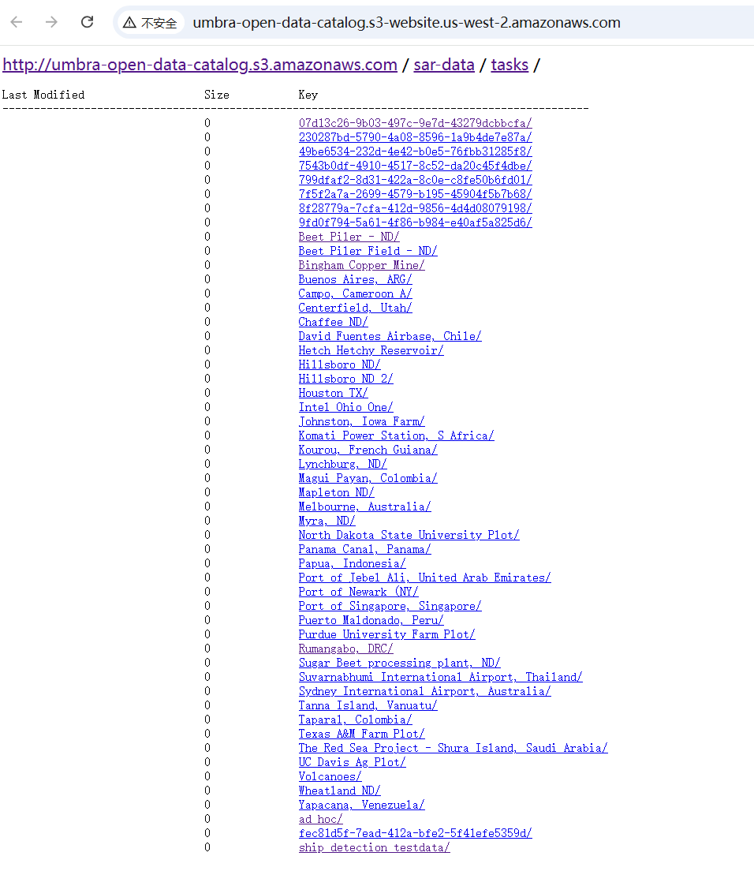
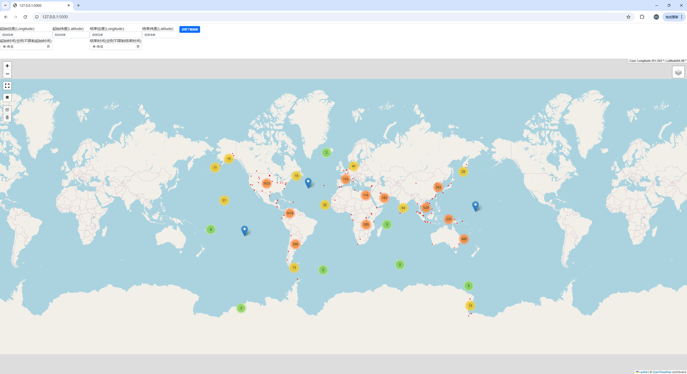

# 介绍
umbra-open-data 数据托管在AWS s3(http://umbra-open-data-catalog.s3-website.us-west-2.amazonaws.com/)服务器上，全部下载挑选所需数据需要花费大量时间(共约49.9TiB)。本工具仅下载 umbra-open-data 的 时空资产目录 (STAC) 并将其在地图上进行可视化，可以根据坐标范围及时间获取影像资源下载链接。获取链接后可使用浏览器或终端工具下载影像资源。

# 环境配置
```
conda create -n [your_env_name] python=3.12
conda activate [your_env_name]
conda install anaconda::flask
conda install tqdm
conda install conda-forge::folium
conda install anaconda::boto3
```


# 使用
## 启动
0. 在终端执行如下命令启动Flask APP:
```
conda activate [your_env_name]
python flask_app.py
```
1. 打开浏览器 http://127.0.0.1:5000/
2. 等待几秒钟，地图将会加载完成:


## 操作
### 获取单个影像资源下载链接
单击矩形区域或定位标记即可  


### 根据坐标范围及时间获取影像资源下载链接
左侧工具栏选择矩形绘制工具，绘制矩形后，单击该矩形即可自动填写坐标。时间可自行填写。  


# 注意
0. 本工具使用folium生成网页，网页中的部分资源加载需要科学上网
1. 下载链接中可能包含空格，如使用终端工具下载，注意使用引号包含链接
2. SATC目录中少部分影像资源
